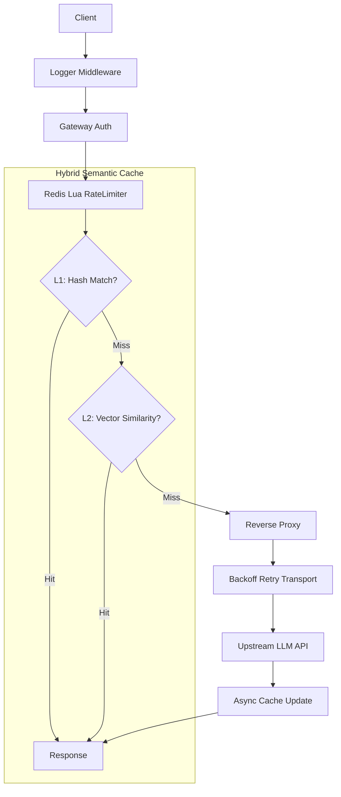

# G-AIGateway

<p align="left">
  <b>高性能、AI 原生、具备语义召回能力的分布式接入网关</b>
</p>

<p align="left">
  <a href="./README.md">
    
  </a>
  <a href="./README_EN.md">
    
  </a>
</p>

<p align="left">
  <a href="https://golang.org/">
    
  </a>
  <a href="https://redis.io/">
    
  </a>
  <a href="LICENSE">
    
  </a>
</p>

<hr style="height:1px; border:none; border-top:1px solid #eeeeee; margin:10px 0;" />

## 🚀 G-AIGateway 是什么？

**G-AIGateway** 是一款面向大语言模型（LLM）应用的轻量级高性能 API 网关。

它提供传统网关能力（**限流、鉴权、重试、可观测性**），并引入核心 AI 原生特性：

> **L1/L2 分级语义缓存（Hybrid Semantic Cache）**  
> 在网关层复用“完全相同”与“语义相近”的请求结果，显著降低 Token 成本与端到端时延。

G-AIGateway 的目标是把 LLM 调用当作**可治理的基础设施依赖**，而不是不可控的外部黑盒 API。

<hr style="height:1px; border:none; border-top:1px solid #eeeeee; margin:10px 0;" />

## 💡 为什么需要它？

生产环境里的 LLM API 通常有三类典型问题：

- **成本高**：重复或语义相近的提问不断消耗 Token  
- **延迟高**：生成式模型端到端响应常见秒级  
- **稳定性差**：上游常见 429（限流）、网络抖动、偶发失败

G-AIGateway 通过把“计算密集型的 LLM 调用”转化为“IO 密集型的缓存检索”，在不侵入业务代码的情况下完成降本与提速。

<hr style="height:1px; border:none; border-top:1px solid #eeeeee; margin:10px 0;" />

## ✨ 核心特性

### 🚀 L1/L2 混合语义缓存

- **L1 精确缓存（Exact Cache）**
  - 基于 SHA256 哈希匹配
  - O(1) 查询，微秒级返回

- **L2 语义缓存（Semantic Cache）**
  - Embedding 向量 + 余弦相似度（Cosine Similarity）
  - 支持“模糊提问/近义表达”的语义召回复用

<hr style="height:1px; border:none; border-top:1px solid #eeeeee; margin:10px 0;" />

### 🛡 稳定性与流量治理

- **分布式原子限流**
  - Redis + Lua 脚本保证原子性（检查/计数/过期）
  - 高并发下避免竞态导致的限流失效

- **智能重试（指数退避）**
  - 面向上游 429 / 临时失败
  - Exponential Backoff 策略屏蔽抖动（规划中/或已实现）

<hr style="height:1px; border:none; border-top:1px solid #eeeeee; margin:10px 0;" />

### 📦 向量存储优化

- Embedding 向量二进制序列化（Little-endian Float32）
- 避免 JSON 编解码开销，降低 Redis 带宽成本

<hr style="height:1px; border:none; border-top:1px solid #eeeeee; margin:10px 0;" />
### 📊 可观测性

- 结构化日志记录：
  - Latency / Status Code / CacheHit（L1/L2）等关键信息
- （规划）Prometheus `/metrics` 指标接口

<hr style="height:1px; border:none; border-top:1px solid #eeeeee; margin:10px 0;" />

## 🏗 系统架构



## 📈 性能表现（Benchmarks）
> 以下数据示例用于说明趋势，实际结果与模型/网络/负载有关。

|场景|上游直连|G-AIGateway(L1命中)|G-AIGateway(L2命中)|
|-|-|-|-|
|平均时延|14,730 ms|1.27 ms|235 ms|
|时延降低|-|99.9%|98.4%|
|Token 消耗|100%|0%|<5%(仅Embedding)|

<hr style="height:1px; border:none; border-top:1px solid #eeeeee; margin:10px 0;" />

## 🧠 核心机制实现

- 语义比对算法
    系统采用余弦相似度（Cosine Similarity）衡量向量间距，公式实现如下：
    $$Similarity = \frac{A \cdot B}{||A|| \ ||B||}$$

    通过设定阈值（默认 0.85），网关能够在语义空间内精准捕获意图一致但表达不同的请求。
- 存储优化
    针对向量数据，项目实现了内存对齐的二进制序列化方案：
    - 存储格式：`[4 bytes Float32] * Dimension`
    - 优势：规避了频繁的 JSON 编解码 CPU 开销，大幅降低 Redis 传输带宽。
- 限流原子性
  通过将限流逻辑封装在 Lua 脚本中发送给 Redis，确保了“检查-增加-过期设置”操作的原子性，避免了在高并发场景下因竞态条件导致的限流失效。

<hr style="height:1px; border:none; border-top:1px solid #eeeeee; margin:10px 0;" />

## 🚀 快速开始
- 环境准备
  - Go 1.21+
  - Redis 6.2+
  - Docker(可选)
- 配置文件
    创建.env 文件并配置相关参数
    ```bash
    DEEPSEEK_API_KEY=your_deepseek_api_key
    TARGET_URL=https://api.deepseek.com
    PORT=8080

    EMBEDDING_API_KEY=your_embedding_api_key
    EMBEDDING_URL=https://open.bigmodel.cn/api/paas/v4/embeddings
    EMBEDDING_MODEL=embedding-3
    ```

<hr style="height:1px; border:none; border-top:1px solid #eeeeee; margin:10px 0;" />

## 🗺 路线图 (Roadmap)

- [x] L1/L2 分级缓存架构
- [x] 指数退避重试机制
- [x] 二进制向量序列化优化
- [ ] 基于 Prometheus 的监控指标导出
- [ ] 支持多后端 API Key 负载均衡
- [ ] 集成本地 LRU 缓存以进一步降低 Redis IO

## 🤝 贡献与反馈
欢迎提交issue或Pull Request！

Authors: [徐筱睿](https://github.com/xUxIAOrUI815)
Email: [1531793838@qq.com](mailto:1531793838@qq.com)