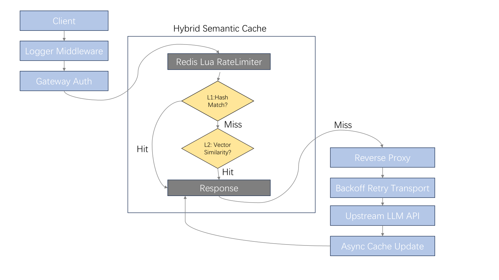

# G-AIGateway

## 🚀 What is G-AIGateway?

**G-AIGateway** is a lightweight, high-performance API gateway designed specifically for Large Language Model (LLM) applications.

It delivers all the capabilities of a traditional gateway (**rate limiting, authentication, retry mechanisms, and observability**), while introducing core AI-native features:

> **L1/L2 Hybrid Semantic Cache**  
> Reuse response results for "exactly identical" and "semantically similar" requests at the gateway layer, significantly reducing Token costs and end-to-end latency.

G-AIGateway aims to treat LLM calls as **governable infrastructure dependencies** rather than uncontrollable external black-box APIs.

## 💡 Why Do You Need It?

In production environments, LLM APIs typically face three common pain points:

- **High Cost**: Repetitive or semantically similar prompts continuously consume tokens.
- **High Latency**: End-to-end responses from generative models often take seconds.
- **Poor Stability**: Upstream issues like 429 (rate limiting), network fluctuations, and occasional failures are common.

G-AIGateway transforms "compute-intensive LLM calls" into "IO-intensive cache lookups" — reducing costs and improving speed **without intruding on your business code**.

## ✨ Core Features

### 🚀 L1/L2 Hybrid Semantic Cache

- **L1 Exact Cache**
  - Leverages SHA256 hash matching
  - O(1) lookup with microsecond-level response

- **L2 Semantic Cache**
  - Uses embedding vectors + Cosine Similarity
  - Supports semantic recall & reuse for fuzzy/paraphrased queries


### 🛡 Stability & Traffic Governance

- **Distributed Atomic Rate Limiting**
  - Ensures atomicity (check/count/expire) via Redis + Lua scripts
  - Prevents rate-limiting failures from race conditions under high concurrency

- **Intelligent Retries (Exponential Backoff)**
  - Targets upstream 429 errors / temporary failures
  - Exponential Backoff strategy to mask service fluctuations (planned / implemented)


### 📦 Vector Storage Optimization

- Binary serialization for embedding vectors (Little-endian Float32)
- Eliminates JSON encoding/decoding overhead and reduces Redis bandwidth costs


### 📊 Observability

- Structured logging includes:
  - Key metrics: Latency, Status Code, Cache Hit (L1/L2)
- (Planned) Prometheus `/metrics` endpoint

## 🏗 System Architecture



## 📈 Performance (Benchmarks)
> The following data examples illustrate trends; actual results depend on the model, network, and load.

| Scenario                | Direct Upstream Call | G-AIGateway (L1 Hit) | G-AIGateway (L2 Hit) |
|-------------------------|----------------------|----------------------|----------------------|
| Average Latency         | 14,730 ms            | 1.27 ms              | 235 ms               |
| Latency Reduction       | -                    | 99.9%                | 98.4%                |
| Token Consumption       | 100%                 | 0%                   | < 5% (Embedding only)|

## 🧠 Core Mechanism Implementation

### 1. Semantic Matching Algorithm
The system uses Cosine Similarity to measure vector distances, with the formula implemented as follows:
$$Similarity = \frac{A \cdot B}{||A|| \ ||B||}$$

By setting a threshold (default: 0.85), the gateway can accurately capture requests with consistent intent but different expressions in the semantic space.

### 2. Storage Optimization
For vector data, the project implements a memory-aligned binary serialization scheme:
- Storage Format: `[4 bytes Float32] * Dimension`
- Advantage: Eliminates CPU overhead from frequent JSON encoding/decoding and significantly reduces Redis transmission bandwidth.

### 3. Rate Limiting Atomicity
By encapsulating rate-limiting logic in Lua scripts and executing them in Redis, the atomicity of "check-increment-expire" operations is guaranteed. This prevents rate-limiting failures caused by race conditions under high concurrency.

## 🚀 Quick Start
### 1. Prerequisites
- Go 1.21+
- Redis 6.2+
- Docker (optional)

### 2. Configuration File
Create a `.env` file and configure the following parameters:
```bash
DEEPSEEK_API_KEY=your_deepseek_api_key
TARGET_URL=https://api.deepseek.com
PORT=8080

EMBEDDING_API_KEY=your_embedding_api_key
EMBEDDING_URL=https://open.bigmodel.cn/api/paas/v4/embeddings
EMBEDDING_MODEL=embedding-3
```

## 🗺 Roadmap

- [x] L1/L2 Hierarchical Cache Architecture
- [x] Exponential Backoff Retry Mechanism
- [x] Binary Vector Serialization Optimization
- [ ] Prometheus-based Metrics Export
- [ ] Multi-backend API Key Load Balancing
- [ ] Local LRU Cache Integration to Reduce Redis IO

## 🤝 Contribution & Feedback

Issues and Pull Requests are welcome!

Authors: [Xu Xiaorui](https://github.com/xUxIAOrUI815)
Email: [1531793838@qq.com](mailto:1531793838@qq.com)